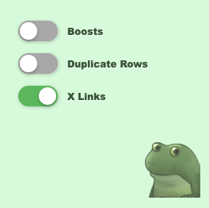
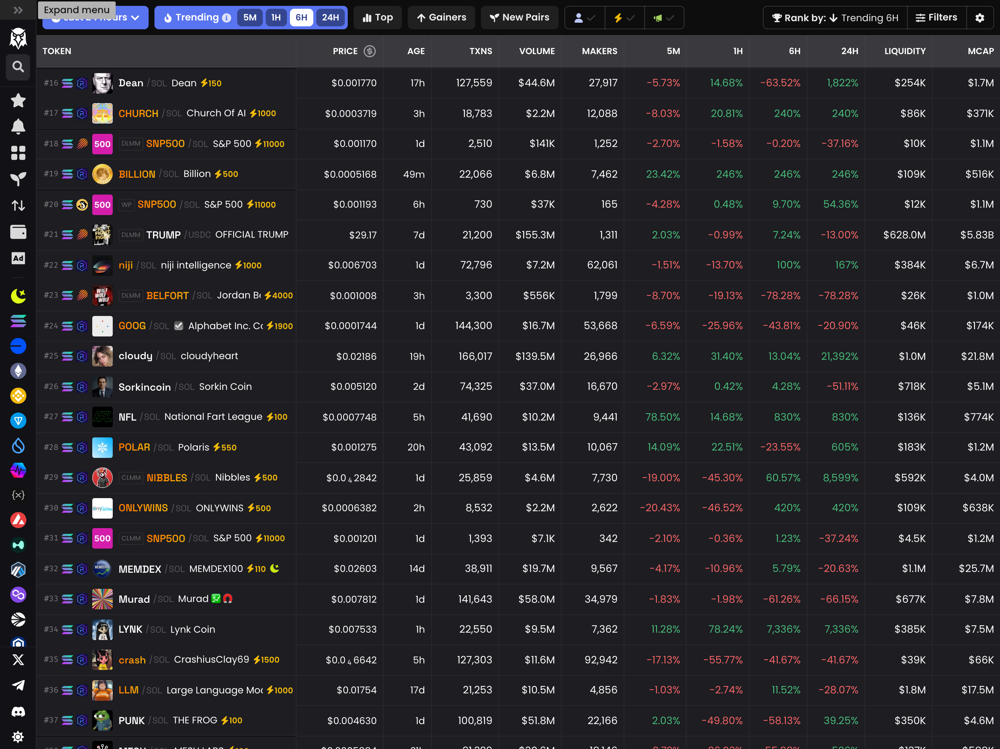
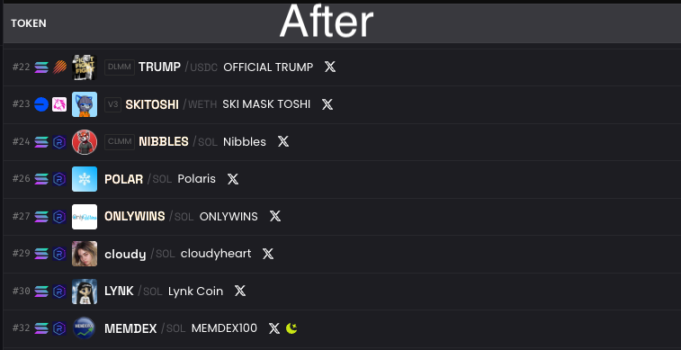

# DexCleaner  

DexCleaner is a Chrome extension I made to fix Dexscreener's annoying UI.  

## Why?  

Dexscreener kinda sucks sometimes:  
1. Boosted tokens with wild colors are distracting.  
2. Duplicate entries clutter the list.  
3. Finding X links takes extra clicks, and that's all I care about most of the time.  

So, I made this extension to fix those issues.  

## What it Does  

DexCleaner:  
✅ Strips ugly boost decorations (doesn't hide tokens).  
✅ Cleans up duplicate rows.  
✅ Adds direct X links right in the list.  

You can toggle these features however you like:  

  

**Before vs. After:**  

| Before | After |  
|--------|-------|  
|  |  |  

## How to Install  

It's not on the Chrome Web Store, but you can add it manually. Here's how:  

1. **Download the Extension Files:** Download or clone this repo.  
2. **Go to Chrome Extensions Page:** Open `chrome://extensions/` in Chrome.  
3. **Enable Developer Mode:** Flip the "Developer mode" switch in the top right.  
4. **Load Unpacked Extension:** Click "Load unpacked" and select the folder where you downloaded/cloned this repo.  
5. **Done!** You'll see the DexCleaner icon in your browser toolbar. Click it to toggle features on/off.  

Enjoy your cleaner Dexscreener experience!  
