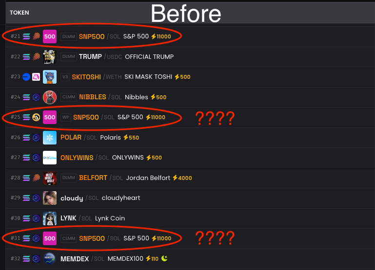

# DexCleaner

DexCleaner is a Chrome extension designed to declutter the Dexscreener website by hiding boosted elements and duplicate rows in token listings, providing a cleaner and more efficient browsing experience.

## Interface

The extension adds a simple popup interface to toggle the features on and off.

## What it Does

DexCleaner helps you focus on relevant information by removing visual clutter.

**Before:**

**After:**

## Installation Instructions

Since DexCleaner is not published on the Chrome Web Store, you can manually load it as an unpacked extension. Here are the steps:

1.  **Download the Extension Files:** Download or clone this repository to your local machine.
2.  **Open Chrome Extensions Page:** Open Google Chrome and navigate to `chrome://extensions/` in the address bar.
3.  **Enable Developer Mode:** In the top right corner of the Extensions page, toggle the "Developer mode" switch to the ON position.
4.  **Load Unpacked Extension:** Click the "Load unpacked" button that appears in the top left corner.
5.  **Select Extension Directory:** In the file dialog, navigate to the directory where you downloaded or cloned the DexCleaner repository and select the folder. Click "Select Folder" or "Open".
6.  **DexCleaner Installed:** DexCleaner should now be installed and enabled in Chrome. You can click the DexCleaner icon in your browser toolbar to toggle the features.

Now you can enjoy a cleaner Dexscreener experience!